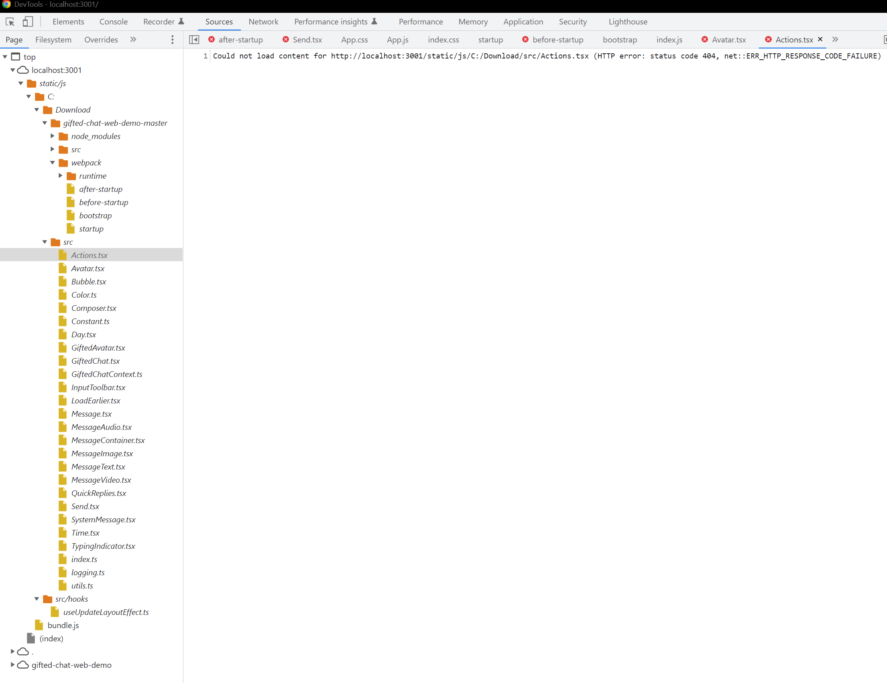

   <a href="https://reverent-bardeen-47c862.netlify.com/">
    
 </a>

# Gifted chat web demo

> [**Demo of Gifted Chat for the WEB**](https://reverent-bardeen-47c862.netlify.com/)

Related to this PR [#1294](https://github.com/FaridSafi/react-native-gifted-chat/pull/1284) from [react-native-gifted-chat](https://github.com/FaridSafi/react-native-gifted-chat).
*****************************************************************************
Dette prosjektet er en versjon av [https://github.com/yashkumarsharma/gifted-chat-web-demo](https://github.com/yashkumarsharma/gifted-chat-web-demo)

Alle pakkene er oppgradert til siste versjon i [package.json](package.json)  
Orginal App.tsx er renamet til OLDApp.tsx, OLDApp.tsx har den orginale eksempelkoden liggende utkommentert.  

Det er lagt til en fil: App.js  
App.js har eksempel ifra forsiden til [react-native-gifted-chat](https://github.com/FaridSafi/react-native-gifted-chat) pr 20 Juli 2022

###### Feil:
Bygging se tilsynelatende ut til å gå bra, men ved åpning i netleseren så vises ikke chaten.

Ved inspeksjon i Developer console så ser jeg at det er flere src mapper hvor det er filer som ikke kan bli lastet. Dette er filer som kommer i fra andre pakker.  
Disse src mappene ser ut til å ligge på andre filstier som ikke er under prosjektet. F.eks  
>Could not load content for http://localhost:3001/static/js/C:/src/hooks/useUpdateLayoutEffect.ts (HTTP error: status code 404, net::ERR_HTTP_RESPONSE_CODE_FAILURE)  

og  
>Could not load content for http://localhost:3001/static/js/C:/Download/src/GiftedChat.tsx (HTTP error: status code 404, net::ERR_HTTP_RESPONSE_CODE_FAILURE)

